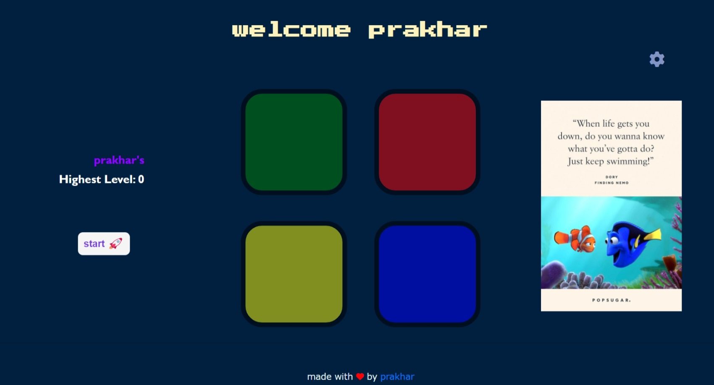
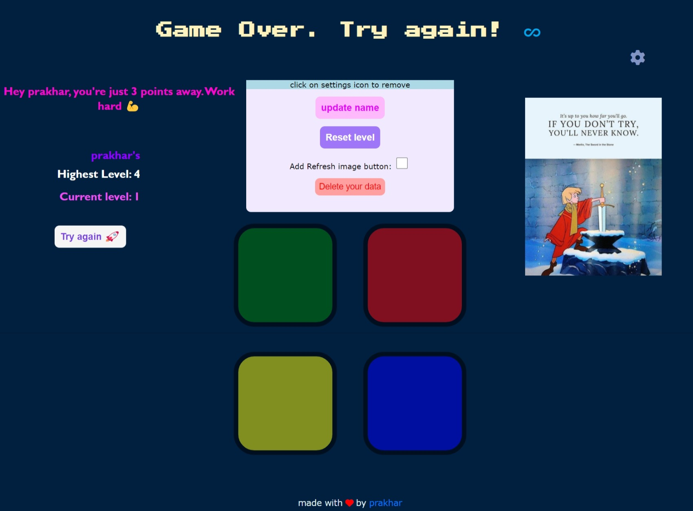
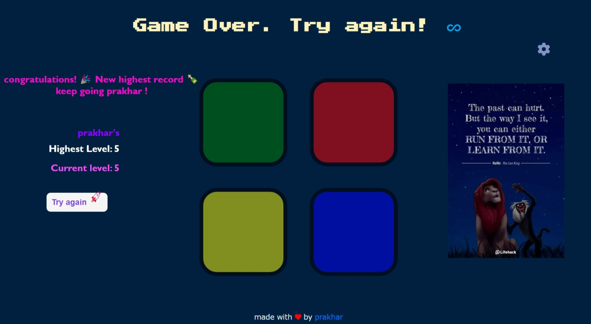
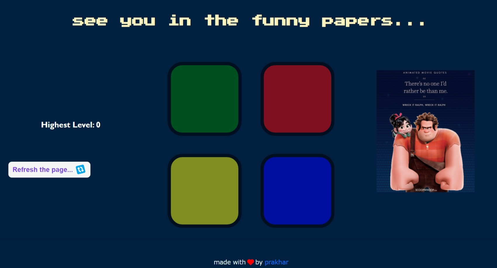

## 🎮 Simon Game 

<h3> Hello everyone, I created this Simon game as a project while learning web development from Udemy
by <a href="https://github.com/angelabauer">Dr. Angela Yu</a> .
</h3>

<h2> I added many new cool features ⚙️ ⚒️ for instance 👇 </h2>

<ul> 
<li> It can remember your name across page refreshes ✅</li>

<li> can provide personalised feedback... <em> all with client side javaScript 🚀</em></li>

<li> It has a nice little settings button ⚙️, which you can use to customize your game experience 🔥 </li>

<li> Random motivational images keeps the game going 😎 </li>

</ul>

<h2> Here are some of the images 👇 </h2>

<ul>
<li>  </li>
<li>  </li>
<li>  </li>
<li>  </li>
 </ul>

 Any feedback is welcome 😀 🙏 ...

 

 Have fun 🎮:) 

